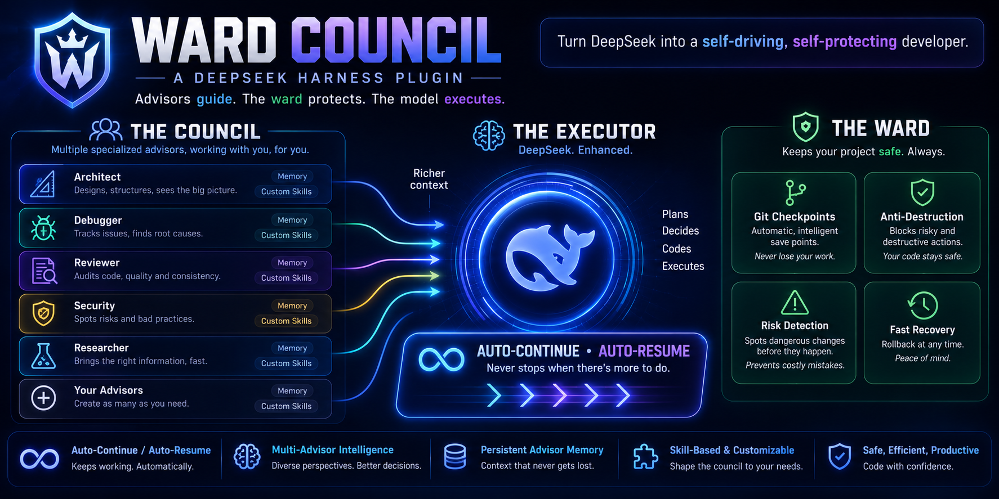

<p align="center">
  
</p>

# Ward Council

*Package name: `dsh-omp-advisor` — the name under which it installs and stores settings.*

**oh-my-pi's advisor subsystem, ported to [DeepSeek Harness](https://github.com/deepseek-ai/dsh) (DSH). Advisors guide. The ward protects. The model executes.**

Attach one or more independent *advisor* models to your live DSH sessions. Each advisor watches the primary agent's transcript as it grows, may investigate the workspace with read-only tools (`read` / `grep` / `glob`), and delivers concrete advice through a dedicated `advise` tool — exactly the advisor-watchdog design from [can1357/oh-my-pi](https://github.com/can1357/oh-my-pi), re-built natively on DSH's plugin seams.

```
primary agent ──► session log ──► delta renderer ──► advisor model (your pick from the DSH model list)
      ▲                                                     │ read/grep/glob (read-only)
      │                                                     ▼
      └──── agent.inject / agent.steer ◄── advise tool ── dedupe + quarantine
```

## How it works

- **Incremental reviews.** Advisors never see the whole history twice: a cursor over the durable session log renders each new slice (`user/message`, `assistant/message`, `tool/call`, `tool/result`) into a compact markdown *update* the advisor model reviews.
- **Advice, not orders.** Notes arrive as
  `<advisory advisor="…" severity="…" guidance="weigh, don't blindly obey">…</advisory>`
  messages. The primary agent decides what to do with them.
- **Severities.** `nit` (default) · `concern` · `blocker`. Escalation-rank dedupe: the same note only re-delivers at a strictly higher severity.
- **Delivery channels (DSH-native).**
  | Severity | Primary running | Primary idle |
  |---|---|---|
  | non-interrupting (default: `nit`) | `agent.inject` — rides the next step boundary, never wakes | `agent.inject` |
  | interrupting (default: `concern`, `blocker`) | `agent.steer` — nearest step boundary | `concern` downgrades to `inject`; `blocker` still steers (may wake a turn) |
- **Mid-turn deferral.** With `reviewTrigger: step`, non-blocker notes raised while the turn is still running are withheld and flushed deterministically when the turn completes, so partial work is not interrupted and no advice is lost.
- **Coalescing (optional).** With several advisors attached, notes can land in rapid succession. Set **Coalesce advice** to a window in ms (e.g. `1500`) and the runtime buffers notes from *all* advisors for that window, then emits them as **one multi-`<advisory>` message per delivery channel** instead of one message per note. Semantics:
  - `0` (default) — every note is delivered individually, exactly as above.
  - Window active — the timer starts on the first buffered note; when it fires, the batch is grouped by channel at emit time (steer vs inject is re-resolved against the primary's *current* state) and sent as one message per non-empty channel.
  - Interrupting severity — a `concern`/`blocker` (per your interrupting set) **flushes the whole batch immediately**, so urgent advice never waits out the window.
  - Session dispose cancels the timer and drops buffered notes: a disposed session never receives advice.
- **Auto-retry (optional, on by default).** Failures recover automatically instead of dying silently:
  - A failed advisor review (rate limit, transient provider error) re-runs the *same* delta after the configured delay, up to the configured attempt cap.
  - A failed **primary-model turn** (`turn/end` with `reason.kind: "error"`) receives an automatic *"continue from where you left off"* followup message after the same delay, bounded per failure episode and reset by any completed turn.
  - Attempt cap: `1–999`, or **`0` = unlimited** (the message labels the cap `∞`). User aborts and permanent errors (unknown model/provider) never retry — even with an unlimited cap. Toggle the whole feature off with **Auto-retry failures**.
- **Blocker intervention (optional, off by default).** DSH exposes no synchronous pre-tool-call veto to plugins, so this is the strongest interruption the platform allows: when an advisor raises a `blocker` while the primary agent is **running**, the plugin calls `agent.cancel` on the running step — tool calls not yet dispatched abort, already-running calls commit — then wakes the agent with the advisory as a followup so it sees the reason and can react. With review trigger `step`, this lands between steps, i.e. before the model can issue the *next* destructive call; a fast tool inside the current step may finish first. Opt in with **Blocker intervention**; without it, advice stays advice.
- **Git restore points (optional, off by default).** The plugin snapshots the workspace into **side-effect-free git objects** — a throwaway index captures tracked changes *and* untracked files (honoring `.gitignore`), stored as commit objects under the hidden namespace `refs/dsh-omp-advisor/**`. Your index, HEAD, branch, and worktree are never touched, and no reset/clean/stash command is ever run. Snapshots happen at turn boundaries and (optionally) **before mutating tools** via pass-through `fs/write-intent` / `fs/edit-intent` / `tools/pre-execute` listeners with a bounded wait that never blocks your tools. Advisors gain read-only `list_restore_points` / `diff_restore_points` tools; after a destructive or wrong step an advisor can call `advise` with `rewindTo` — the advisory then carries the exact worktree-only restore recipe (`git restore --source=<sha> --worktree --staged .`) plus the advisor's classification of **which steps must not happen again and which were progress**. The primary model executes the restore itself; the plugin never rewinds anything. Files created after a point are kept, never deleted. Non-git workspaces are skipped.
- **Completion gate (on by default, prompt-only).** When the watched agent moves to finish ("done", "all tests pass", goal completion), the advisor verifies the original ask is actually implemented — against the workspace and, when restore points exist, the session's baseline→now diff. If not, it instructs the agent to **report honestly what was done and what wasn't, and ask you whether the partial state is acceptable**. Once the work is verified complete — or you explicitly accept the compromise — the advisor's `acceptance` advisory reminds the agent to **commit the accepted state to the branch it is working on** (the plugin marks the latest restore point accepted; the agent runs the commit).
- **Tiny-delta skip (optional).** With **Skip tiny deltas** set, transcript updates smaller than the threshold are skipped without calling the advisor model — a cheap way to cut advisor traffic on chatty sessions (skipped deltas are not replayed later).
- **Containment (ported).** Output quarantine (unavailable-tool requests, output-only destructive directives), 3-consecutive-failure backlog drop, permanent-error halt until settings change, quota/rate-limit cooldown pause. The advisor **never blocks the primary agent** — a deliberate, safer deviation from oh-my-pi's catch-up wait.
- **Multi-tab settings UI.** The settings section is organized like the Plugin Market's inner tab bar: **General** (policy switches), **Advisors** (the roster — cards collapsed by default, click a header to expand), **Workspaces** (a workspace × advisor activation matrix over the same `workspaces` field), **Memory** (persistent advisor memory — pluggable engines, write gate, per-advisor engine toggles), and **Monitor** (live status + activity feed).
- **Advisor memory (v0.7.0).** Advisors recall relevant long-term lessons into each review and write durable lessons back, through a pluggable engine roster: a built-in per-workspace plaintext store (default), OpenViking, Hindsight, MisakaNet, mem0, and any custom MCP memory server. Multiple engines run at once, each advisor picks its own, unavailable engines are grayed out and never block a review, and a write gate (approval / auto / read-only) controls what gets stored.
- **Optional sidebar monitor tab.** When [dsh-better-sidebar](https://github.com/omdsh-dev/DSH-better-sidebar) is installed, the plugin registers an **Advisors** tab in the sidebar workbench: a **workspace-scoped** monitor: the tab follows the sidebar's session scope, so it shows this session's name and workspace, its attached advisors (status dot, review/advice counters, last error) and its activity feed — other sessions stay collapsed under "Other sessions", and the tab-strip badge counts only this session's advisors (`!` when one is halted/errored, hidden when none are attached here). Detection is a bounded runtime probe — **never a hard dependency**: without the sidebar the plugin loads and behaves exactly as before.

## Install

**Prerequisites**

- DeepSeek Harness `0.1.0-rc.8` or newer with the **web profile** (`dsh web`).
- At least one model configured in DSH's model list — each advisor needs a provider route + model picked from that list.
- The plugin is inert until enabled: the master switch (**Attach advisors to sessions**) is **off by default**.

**Install**

```bash
# from GitHub
dsh plugin --profile web add github:AndrasSama/dsh-omp-advisor
# or from a local checkout
dsh plugin --profile web add "file:/path/to/dsh-omp-advisor"
```

Then **restart DSH Web** and **hard-refresh the browser** (Ctrl+Shift+R). The restart is mandatory: a running server computes plugin bundle revisions at startup, so a freshly installed or updated plugin never appears until the server process restarts.

**Verify**

1. Open **Settings** in the DSH Web GUI — a **Ward Council** section must be present.
2. Its **Live status** panel lists sessions with attached advisors once the master switch is on.
3. First run: enable the master switch, click **Add from preset** (or **+ Add advisor**), pick a model from the dropdown, and start any session — the advisor chip appears in Live status within one turn.

**Upgrade / uninstall**

```bash
# upgrade: re-run add with the same spec, then restart DSH Web
dsh plugin --profile web add github:AndrasSama/dsh-omp-advisor
# uninstall (settings in the dsh-omp-advisor namespace stay on disk)
dsh plugin --profile web remove dsh-omp-advisor
```

**Rate-limit guidance.** Each advisor makes one model call per reviewed transcript update. On tight free tiers (e.g. 5 req/min), keep **Review trigger** on `turn`, keep the roster small, and leave **Auto-retry** on with a delay at least as long as the provider's rate window.

### Agent install prompt

Hand this to an AI agent with shell access to the DSH host — it is self-contained:

```text
Install the dsh-omp-advisor plugin into the DSH web profile.

Context:
- DSH CLI: `dsh` (must be on PATH; often ~/.npm-global/bin/dsh). Version must be
  0.1.0-rc.8+. The web profile directory is ~/.dsh/profiles/web (pnpm-managed).
- `dsh plugin --profile web <cmd>` delegates to pnpm inside that profile dir.
- A `dsh web` server may currently be RUNNING and hosting live user sessions.
  NEVER kill it yourself unless the user explicitly says they will restart it;
  the plugin only activates after a server restart, so finish the install and
  then ask the user to restart `dsh web` and hard-refresh the browser.

Steps:
1. Install from GitHub:
     dsh plugin --profile web add github:AndrasSama/dsh-omp-advisor
   (or from a local checkout: dsh plugin --profile web add "file:/abs/path/to/dsh-omp-advisor")
2. Verify it registered:
     dsh plugin --profile web list | grep dsh-omp-advisor
   Expect one line showing dsh-omp-advisor.
3. Sanity-check the installed copy at ~/.dsh/profiles/web/node_modules/dsh-omp-advisor:
   package.json version matches the release, and lib/index.js + lib/client.js +
   skills/ exist. KNOWN PITFALL with `file:` installs: pnpm hardlinks files at
   first install, so later edits to the source checkout can leave the installed
   copy partially stale. If anything looks stale, mirror the checkout over it:
     rsync -a --delete --exclude node_modules --exclude .git \
       /abs/path/to/dsh-omp-advisor/ ~/.dsh/profiles/web/node_modules/dsh-omp-advisor/
4. Ask the user to restart `dsh web` and hard-refresh the browser (Ctrl+Shift+R).
5. Post-restart verification in the GUI: Settings shows a "Ward Council"
   section. The plugin is INERT until the user enables "Attach advisors to
   sessions" (off by default) and adds at least one advisor with a model picked
   from the DSH model list — tell them this.
6. If the section is missing after restart: check the server log for plugin
   load errors, confirm step 2/3, and confirm the browser was hard-refreshed.

Do not edit ~/.dsh/settings.yaml by hand for this plugin; configuration lives
in the dsh-omp-advisor settings namespace and is edited through the GUI section.
```

## Configure

Open **Settings → Ward Council**. The section has five inner tabs — **General**, **Advisors**, **Workspaces**, **Memory**, **Monitor** — patterned after the Plugin Market's sub-tab bar.

**General tab:**

- **Attach advisors to sessions** — master switch (off by default).
- **Review trigger** — `turn` (review completed turns) or `step` (review while the turn runs). Step mode fires on every tool step — the UI warns it is heavy on rate-limited or metered providers.
- **Interrupting severities** — which severities steer; the rest ride as non-interrupting context.
- **Coalesce advice (ms)** — `0` = deliver each note immediately; `>0` = batch notes from all advisors within the window into one message per channel (see [How it works](#how-it-works)). Clamped to 0–10000.
- **Auto-retry failures** — toggle + delay (ms, 1000–300000, default 5000) + attempt cap (0–999, default 3, **0 = unlimited**). Retries failed advisor reviews and sends an automatic "continue" to a failed primary turn (see [How it works](#how-it-works)).
- **Blocker intervention** — off by default. When on, a blocker raised while the primary runs cancels the running step and wakes the agent with the advisory (see [How it works](#how-it-works)).
- **Restore points** — off by default. When on, snapshots the workspace into hidden git refs at turn boundaries; **keep** sets how many per session (1–100, default 20) and **also snapshot before mutating tools** (on by default) captures before writes/edits/bash. Advisors can then recommend rewinds and verify completion against the session baseline (see [How it works](#how-it-works)).
- **Completion gate** — on by default (prompt-only, zero extra calls). The advisor verifies work is actually done before the agent claims completion, demands an honest done/not-done report otherwise, and reminds the agent to commit the accepted state (see [How it works](#how-it-works)).
- **Skip tiny deltas (chars)** — `0` = review everything; `>0` = skip transcript updates smaller than this.
**Advisors tab:**

- **Add from preset** — one click creates a ready-made advisor from one of the 25 built-in personas (see [Presets](#presets)).
- **Advisors** — the roster, as collapsible cards (**collapsed by default** — click a card header to expand; newly added advisors expand automatically). Per advisor:
  - name,
  - **model picked from the DSH model list** (provider route → model → optional reasoning effort),
  - **max turns** — the advisor's tool-loop budget per review (1–10, default 4),
  - optional specialization instructions (e.g. *"Focus on security: injection, secrets, unsafe deserialization."*),
  - **workspaces** — comma-separated patterns matched against the session's workspace path; the advisor only runs in matching sessions (empty = every session). Plain patterns are SUBSTRING matches — `/home/sama` also matches `/home/sama/anything` — so for broad paths prefix with `=` for an exact cwd match (`=/home/sama`). This is how you give the writing bench to your novel workspace and the engineering bench to your code workspace.
  - **skills** — the advisor's curated skill chips: remove one (`×`), add any packaged skill from the catalog dropdown, or **reset to preset defaults** if the advisor was created from a preset (see [Skills](#skills)),
  - **skill delivery** — `inject` (default: full skill bodies in the system prompt) or `lazy` (id+description index plus a `load_skill` tool — saves tokens, costs one extra call per loaded skill),
  - **memory engines** — which long-term memory engines this advisor recalls from and writes to (see the **Memory** tab). None checked = the built-in plaintext store only; unavailable engines are grayed out here too,
  - per-advisor enable toggle.

**Workspaces tab:**

- A **workspace × advisor matrix**: rows are known workspaces (every workspace open in a session plus every pattern already configured), columns are advisors. A checked cell means that workspace pattern is in the advisor's list; toggling rewrites the same `workspaces` field the card editor uses. An advisor with no patterns runs everywhere — its cells render indeterminate, and checking one scopes it to that single workspace. A free-text row lets you add a workspace pattern that no session has opened yet.

**Memory tab (v0.7.0):**

Advisors get persistent, workspace-scoped memory: before each review they **recall** relevant lessons into their context, and after a review they may **write** a durable lesson back. Multiple engines can run at once, and each advisor picks its own engines on its card.

- **Enable advisor memory** — master switch (on by default). When off, no recall runs and nothing is stored.
- **Write gate** — who may store lessons:
  - **Approval** (default) — advisor-proposed lessons queue as *pending* and are stored only when you approve them in the **Pending lessons** list (or the Monitor tab).
  - **Auto** — lessons store immediately.
  - **Read-only** — recall only, never write.
- **Recall budget** — max items per engine (1–10, default 3) and total characters per review (500–40000, default 6000). Recalled items are merged through a single pack layer: per-engine cap, cross-engine dedup, score-ordered, budget-truncated — and injected as the *last* prompt block so prompt-prefix caching stays stable.
- **Memory engines** — the engine roster with live probe status (green = available, yellow = needs setup, gray = unavailable). Unavailable engines are grayed out and skipped at runtime; they never block a review. **Rescan** re-probes on demand. Engines:
  - **Plaintext MD (built-in)** — the default. One append-only markdown lesson file per workspace at `<workspace>/.dsh-omp-advisor/lessons.md`, recalled with a deterministic BM25-lite keyword search. Zero LLM calls, zero dependencies, human-editable.
  - **OpenViking** — drives the same stdio MCP proxy the [OpenViking memory plugin](https://www.npmjs.com/package/@openviking/dsh-memory-plugin) starts (`servers/mcp-proxy.mjs`, auto-resolved from the profile's node_modules). Recall via `find`, store via `remember` — so OpenViking lessons can be written too. (The plugin's `openvikingMemory` host service is isolate-scoped and not reachable across plugins, hence the proxy.)
  - **Hindsight** — spawns Hindsight's bundled stdio MCP server (`dist/mcp-server.js`, auto-resolved) with `HINDSIGHT_MCP_HARNESS=dsh`; recall/search knowledge pages and ingest lessons.
  - **MisakaNet** — read-only failure-lesson network (verified debugging lessons), probed via its local MCP adapter when present. Its raw MCP tools use dotted names (`deepseek.recovery.search`); DSH only rewrites dots→underscores when surfacing tools to agents, so the preset matches the dots.
  - **mem0** — self-hosted mem0 MCP server (ships disabled; fill the endpoint and enable).
- **Add custom MCP engine** — point the advisor at *any* MCP memory server (mem0, Graphiti, Cognee, a private store…). Provide an id, transport (stdio command/args/cwd or HTTP url), the recall/store tool names, and a read-only flag. This is the catch-all for frameworks without a dedicated preset.
- **Engine script auto-resolution** — builtin stdio presets that live in *another* package (OpenViking, Hindsight) use a `resolveScript` specifier resolved across the enclosing and profile node_modules at spawn time, so no profile-specific absolute path is hardcoded. If the package isn't installed the engine shows "not installed" and stays gray.
- **Preset migration** — builtin engine definitions are versioned. When a release changes a preset (tool names, transport, spawn command), your persisted copy of the old preset is re-derived from the new one automatically (your enable/disable toggles carry over; custom engines are never touched).
- **Pending lessons** — when the write gate is Approval, advisor-proposed lessons wait here with their tags and target engines; **Approve** stores them, **Discard** drops them. Pending writes persist per workspace and survive restarts.

**Monitor tab:**

- **Live status** — per-session advisor status dots, backlog, review/advice counters, last errors, restore-point counts.
- **Activity feed** — the service-wide event ring (≤100, newest first): reviews with duration, advice deliveries with severity+channel, retries, quota cooldowns, halts, blocker interventions, restore-point snapshots, session attach/detach. The same feed powers the optional sidebar tab.

Settings live in the `dsh-omp-advisor` namespace and apply **live** — no restart needed when you edit the roster.

Advisor model calls go through `ctx.llm.stream` with the provider route + model id you picked, so billing, routing, and failover behave exactly like your other DSH model traffic.

## Presets

The **Add from preset** dropdown ships 25 ready-made advisor personas. Applying a preset creates a new advisor (name collisions get a numeric suffix) whose specialization instructions are the persona's expanded *soul description* and whose skill list is the persona's 10 curated skills. You can then edit everything — model, instructions, skills — like any advisor.

| # | Role | Preset |
|---|---|---|
| 1 | High-Concurrency Backend | The Rustacean Weaver |
| 2 | AI Inference Integrator | The Weights Whisperer |
| 3 | Appchain Developer | The Genesis Architect |
| 4 | Infrastructure Admin | The Edge Guardian |
| 5 | Python Service Architect | The Django Synthesizer |
| 6 | Node.js Systems Dev | The Event Loop Maestro |
| 7 | Harness Plugin Creator | The Meta Coder |
| 8 | Code Review Gatekeeper | The Linting Oracle |
| 9 | Technical Writer | The Clarifier |
| 10 | Security Auditor | The Red Teamer |
| 11 | Digital Marketing Strategist | The Conversion Alchemist |
| 12 | Direct Response Copywriter | The Hook Master |
| 13 | Web Novel Architect | The Worldbuilder |
| 14 | Author Community Manager | The Patron Whisperer |
| 15 | Investigative Journalist | The Fact Finder |
| 16 | Editorial Desk Editor | The Style Enforcer |
| 17 | Financial Analyst | The Ledger Reader |
| 18 | Legal Contract Reviewer | The Clause Hunter |
| 19 | GDPR & Privacy Officer | The Data Steward |
| 20 | EU AI Act & Governance | The Model Auditor |
| 21 | IP & Copyright Sentinel | The License Guardian |
| 22 | Cybersecurity & NIS2 Readiness | The Resiliency Engineer |
| 23 | E-Commerce & Consumer Protection | The Consumer Shield |
| 24 | Privacy-by-Design Engineer | The Minimizer |
| 25 | Agent Tool-Safety Guardian | The Tool Warden |

Domain presets (finance, legal, privacy, marketing…) frame their advice as **review flags and analysis, not professional counsel** — the soul descriptions tell them to surface risks and defer final judgment to qualified humans.

## Skills

The plugin packages **250 advisor skills** under [`skills/<id>/SKILL.md`](./skills) — 10 curated per preset. Each skill is a compact briefing (what to watch for, best practices, a quick checklist) that sharpens the advisor in a specific domain, e.g. `n-plus-one-query-audit`, `prompt-injection-via-tool-results`, `gdpr-data-mapping`, `cliffhanger-mechanics`.

- **Injection (default).** An advisor's configured skill bodies are embedded into its system prompt as `<skills><skill name="id">…</skill></skills>` on every review call. Unknown ids are skipped, never fatal. One model call covers everything — best on rate-limited providers.
- **Lazy loading (opt-in per advisor).** With skill delivery set to `lazy`, the system prompt carries only an id+description index and the advisor gets a `load_skill` tool to fetch a body on demand. Saves ~15KB of prompt per advisor; each loaded skill costs one extra tool-loop call, so prefer it on token-metered providers with headroom.
- **Per-advisor editor.** Every advisor card lists its skills as chips: `×` removes one, the **+ add packaged skill…** dropdown adds any of the 250 (with its description as tooltip), and advisors created from a preset get a **reset to preset defaults** button restoring the curated list.
- **Build-time embedding.** `scripts/gen-skills.mjs` scans `skills/` and generates the host embed (full bodies) and the client catalog (ids + descriptions) before every build and test run; the `skills/` tree is the source of truth and ships in the package.

## Safety model

- Advisors get **read-only** tools confined to the watched session's workspace (`read`, `grep`, `glob`, plus `load_skill` in lazy mode). No mutating tools yet — oh-my-pi's WATCHDOG.yml grant system is planned for a later release behind DSH's approval flow (see Blocker intervention for what exists today).
- Advisor output passes a quarantine before it can become context: requests for unavailable tools and output-only destructive directives (ported hazard patterns) are replaced with a sanitized error.
- Advisories injected into the session are excluded from future advisor deltas (no feedback loops).
- The plugin never blocks or gates the primary agent on its own initiative. Auto-retry only ever *adds* a followup message after a failed turn, and stops after the configured attempt cap (permanent errors never retry). The one exception is the **opt-in** blocker intervention: only when you enable it does a blocker advisory cancel the running step — and even then already-running tool calls are never killed.
- **Restore points are additive only.** Snapshots write commit objects under `refs/dsh-omp-advisor/**` via a throwaway index — the user's index, HEAD, branch, and worktree are never touched; only an allowlist of git verbs runs, object ids spliced into arguments are SHA-format validated, prompts are disabled, and every spawn has a hard timeout. Restores and commits are always executed by the primary model (under your normal tool authority/approvals), never by the plugin; a restore keeps files created after the point instead of deleting anything. Pre-mutation snapshot waits are bounded so a tool call is never blocked on git.
- The `/dsh-omp-advisor` RPC registers with `authority: 'trusted-host'`: requests pass the same Host/Origin trust fence as `/api` (loopback, or a deployment's `--trusted-host` authorities), so the settings section and live status panel also work from remote GUIs. Handlers return `RpcResult` values and never throw.
- Settings reads and writes ride that same channel (`snapshot` / `update` endpoints) instead of `ctx.settingsScope`: DSH keeps settingsScope persistence loopback-only, so a scope-bound section would render "unavailable" in every remote browser. Host-side, `update` still goes through the settings domain's schema + validation + live watch.

## Development

```bash
npm install        # dev deps only; DSH packages are runtime-provided
npm run build      # gen-skills + host ESM (lib/index.js) + client CJS ModuleLoader bundle (lib/client.js)
npm test           # 128 unit tests over the ported semantics + memory
npm run typecheck  # tsc --noEmit (DSH packages shimmed)
```

Layout: `src/` host plugin (settings, service, runtime, advisor loop, tools, delivery, quarantine, delta, restore-points), `src/client/` settings section (multi-tab) + presets + optional better-sidebar tab (`sidebar.tsx`), `src/prompts/` ported advisor prompts (incl. the completion-gate protocol), `skills/` the 250 packaged advisor skills (source of truth for the build-time embeds), `scripts/gen-skills.mjs` the skill embed generator, `test/` node:test suite (git-backed tests run against real temporary repositories and skip cleanly when git is absent; client modules are tested through a minimal React stub).

## Attribution & license

Advisor semantics and prompt texts ported from [can1357/oh-my-pi](https://github.com/can1357/oh-my-pi) (`packages/coding-agent/src/advisor/`), © Mario Zechner / Can Bölük / Stencil Labs, under the MIT license reproduced in [`NOTICE-oh-my-pi-LICENSE`](./NOTICE-oh-my-pi-LICENSE). This plugin is an independent port for DeepSeek Harness and is not affiliated with the oh-my-pi project.

The restore-point design borrows patterns (no code) from two community plugins: [PerryLink/dsh-checkpoint-rewind](https://github.com/PerryLink/dsh-checkpoint-rewind) (Apache-2.0) — side-effect-free git-object snapshots, pre-mutation capture listeners, worktree-only restore that keeps post-snapshot files — and [Anionex/dsh-turn-rewind](https://github.com/Anionex/dsh-turn-rewind) (BSD-3-Clause) — the explicit-only / no-Git-control-plane-mutation safety contract. Thanks to both projects for publishing their designs.

The optional sidebar monitor tab integrates with [omdsh-dev/DSH-better-sidebar](https://github.com/omdsh-dev/DSH-better-sidebar) (MIT) through its public `ctx.betterSidebar.registerTab` service API, following its external-plugin guide (optional peer dependency, effect-wrapped registration, runtime probe instead of a hard inject).

**License.** Ward Council is distributed under the **SamaCorp Inc. Personal Use License** — see [`LICENSE`](./LICENSE): full license for personal use and modification; **no sale** of the software or modified derivatives; unauthorized sales trigger full buyer refunds plus legal fees and $50 per copy sold owed to SamaCorp Inc. One carve-out: the advisor semantics and prompts ported from oh-my-pi remain under MIT (see [`NOTICE-oh-my-pi-LICENSE`](./NOTICE-oh-my-pi-LICENSE)), as MIT requires — those portions keep their MIT terms in every copy. Versions up to and including v0.6.0 were released under MIT; copies already distributed under MIT keep those terms (the relicense is forward-only, from v0.6.1).

## Known limitations

- Advisories render as ordinary plugin messages in the conversation (a dedicated advisory card is future work).
- Restore points need a git worktree: non-git (and unborn-HEAD) workspaces are skipped, and sparse checkouts/submodules are out of scope for snapshots. A restore keeps files created after the point — deleting them is the model's deliberate judgment call, guided by the advisory.
- Consuming `ctx.changeLedger` when dsh-turn-rewind is installed, human-approval (`ask`) routing for risky tool patterns, and session-state (seed-replay) rewind are all future work.
- No mutating-tool grants for advisors yet (oh-my-pi's WATCHDOG.yml roster). Blocker intervention (opt-in step cancellation) is the first intervention layer; full WATCHDOG grants remain targeted for a later release behind the DSH approval flow.
- No in-session "advisors watching" badge yet; health is visible in the settings Monitor tab and — with dsh-better-sidebar installed — in the sidebar Advisors tab (status badge included).
- Status panel polls every 5 s while the settings section is open (sidebar tab: 2 s while registered); no push yet. The activity ring is in-memory only (≤100 events, lost on restart) — monitoring, not audit.
- **Advisor memory shipped in v0.7.0** (see the **Memory tab** above): per-workspace plaintext lesson store with deterministic zero-LLM recall, a pluggable engine roster (OpenViking / Hindsight / MisakaNet / mem0 / any custom MCP server), per-advisor engine toggles, and an approval / auto / read-only write gate. Still ahead: composing memory with restore points (rewind lessons) and the completion gate (compromise records), MCP connection pooling, a dedicated memory browser, and per-engine write confirmations.
- Web profile UI; other profiles can still configure the namespace by hand.
